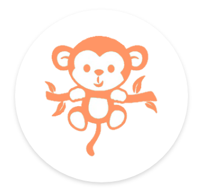
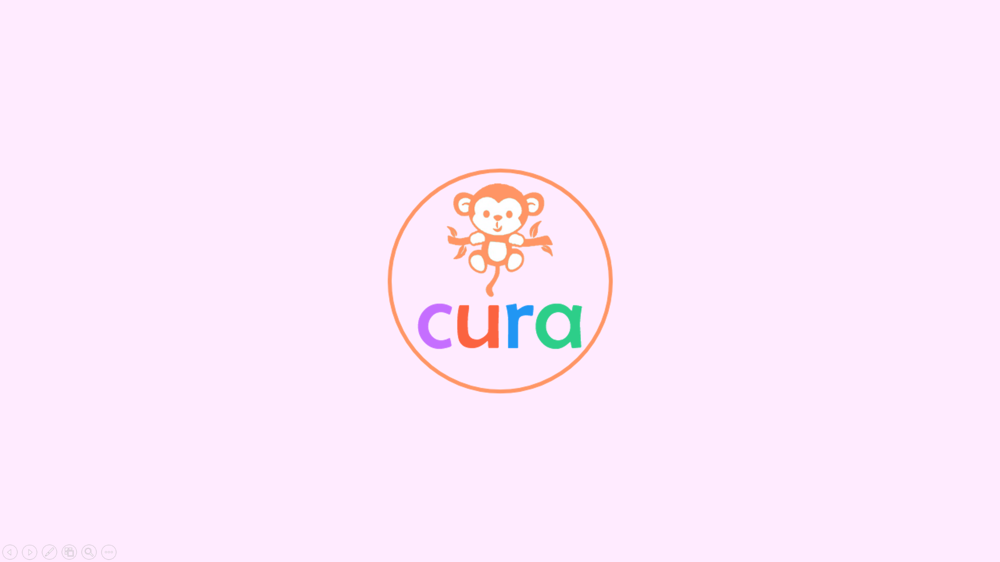

# cura Logos

When we started the project, we knew what we wanted to develop but had no idea what to call it. Instead of worrying about it, we simply got to work on developing the project. It wasn't until a few weeks before the final deadline that we finally came up with a name and logo.

Initial placeholder logo:

      

Intial full page image used in our presentation and video:

      

We then finally came up with a name and logo:

cura, a simple and easy name meaning cure, treatment, and remedy in Latin

The monkey logo acted as our mascot. A fun, lovable creature to guide and assist children in using the app

cura logo with full monkey:

      

cura logo with monkey head:

      

This then lead to the full page:

      

And of course an update on the original:

      

